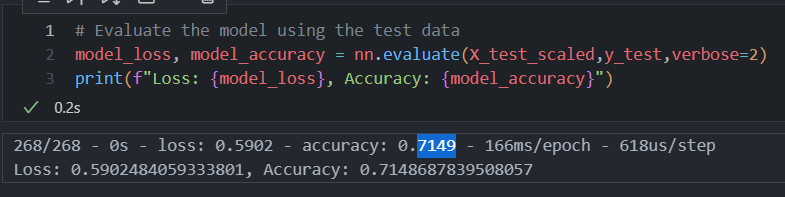
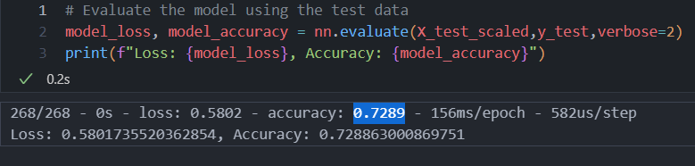
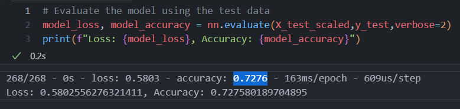
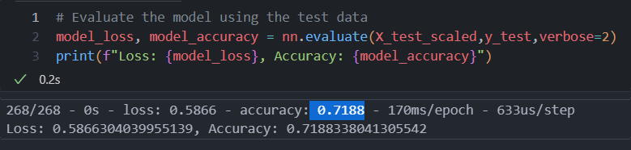

Module 21 Challenge Report

**Overview:**
Alphabet Soup, a nonprofit foundation, wants an application that can select candidates with the best chance for success. In this project, a csv with data on over 34,000 organizations that had previously received funding. With this goal and data in mind, a neural network model was built.

**Review:**
Data Processing
-	The target variable was a “IS_SUCCFULL” column marking with 1 or 0 if a projet was successful
-	The features were "APPLICATION_TYPE", "AFFILIATION", "CLASSIFICATION", "USE_CASE", "ORGANIZATION", "INCOME_AMT"
-	These columns were removed because they were neither target nor features: “EIN”, “NAME”, “SPECIAL_CONSIDERATIONS”
Compiling, Training, and Evaluating the Model:
-	There were 41 neurons because this was as many available categories of data that seemed possibly relevant.
-	There are five layers because 3-5 layers was an optimal number.
-	ReLU, sigmoid, and tanh were the models included because diversifying the model had a good chance at optimization.
-	The target goal of 75% accuracy was not achieved.
-	In order to increase model performance, the column “SPECIAL_CONSIDERATIONS” was removed because most of the data was the same output, making it very poor at predication. Additionally, more hidden layers were added and these layers were diversified by having layers for ReLU, sigmoid, and tanh models.

**Summary:**
The accuracy of the original model was .7149.

After removing the “SPECIAL_CONSIDERATIONS” column the accuracy went up slightly to .7289

After adding an additional sigmoid layer the accuracy dropped slightly to .7276

After adding an addition tanh layer the accuracy dropped slightly to .7188

**Conclusion**
In conclusion, a different model may be needed to optimize the data. Random Forest is one machine learning model we could try instead. It can break down the categorical data which is present in the data set. It is more robust than decision trees and less prone to overfitting. This may or may not be the best model, but trying different models and comparing them is the best method to create an effective model.
